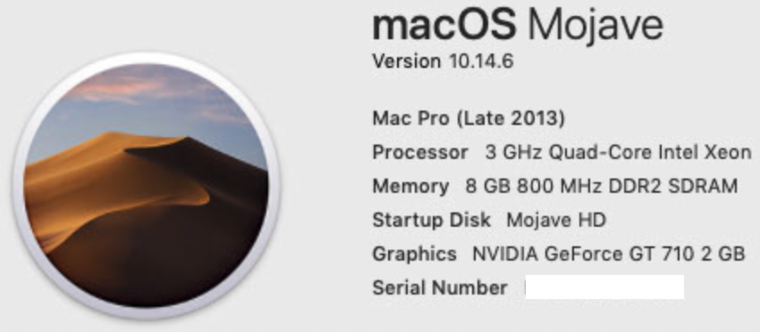
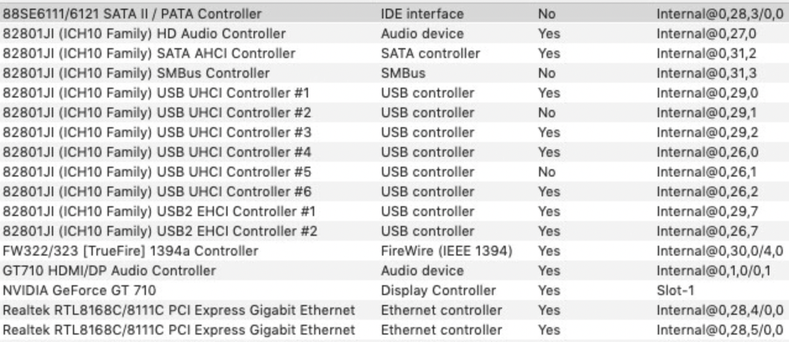

# ASUS-P5Q-WS-Core2Quad-Q9650
  

  
 

  

  
 

## Specs
| **Component** | **Model** |
| ------------- | --------- |
| CPU | Core2Quad 4 cores and 4 threads @ 3.0GHz |
| RAM | 4x2GB 800MHz DDR2 |
| Audio Chipset | Realtek ALC1200. Works with Layout-id 5 |
| dGPU | NVidia GT710. Works OOB |
| Lan |  Gigabit LAN (Realtek RTL8111C) |
| OS Disk | 128GB Samsung SATA 850 Pro |
| macOS | Mojave 10.14.6 / OpenCore 0.7.0

## BIOS
| **Setting** | **Value** |
| ------------- | --------- |
| Configure SATA | AHCI |
| Max CPUID Value Limit | Disabled |
| Memory Remap Feature | Enabled |
| I/O Port Decode | 4K Decode |
| Suspend Mode | S3 only |
| Repost Video on S3 Resume | Yes |
| ACPI 2.0 Support | Enabled |
| ACPI APIC Support | Enabled |

